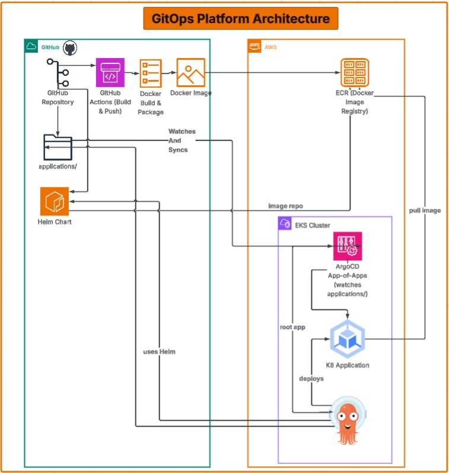

# GitOps Platform on AWS

A comprehensive GitOps platform leveraging AWS CDK for infrastructure, Docker for containerization, Helm for Kubernetes deployments, and ArgoCD for GitOps-driven application delivery.

## Table of Contents

1. [Architecture Overview](#architecture-overview)
2. [Infrastructure](#infrastructure)
3. [Application](#application)
4. [Helm Chart](#helm-chart)
5. [ArgoCD Configuration](#argocd-configuration)
6. [GitHub Workflows](#github-workflows)

---

## Architecture Overview



This project implements a cloud-native GitOps workflow on AWS:

- **Infrastructure as Code (IaC)**: AWS CDK provisions EKS, ECR, networking, and IAM resources
- **Containerization**: Applications are packaged as Docker images and stored in Amazon ECR
- **Kubernetes Deployment**: Helm charts define application configurations and deployments
- **GitOps**: ArgoCD automatically deploys and synchronizes applications from Git

---

## Infrastructure

The infrastructure is defined using **AWS CDK** with TypeScript in the `infrastructure/` directory.

### Overview

The infrastructure deployment creates two main stacks:
1. **CommonNetworkStack**: VPC and networking resources
2. **EksEcrStack**: EKS cluster, ECR repository, and IAM roles

### Common Network Stack

Located in `infrastructure/lib/common-network-stack.ts`, this stack provisions:

- **VPC**: A Virtual Private Cloud with:
  - 2 Availability Zones for high availability
  - Public subnets with Internet Gateway access
  - Private subnets with NAT Gateway for egress traffic
  - Automatic route table configuration

Configuration:
```typescript
- MaxAZs: 2
- NatGateways: 1
- Public Subnets: /24 CIDR blocks
- Private Subnets: /24 CIDR blocks with PRIVATE_WITH_EGRESS
```

### EKS and ECR Stack

Located in `infrastructure/lib/eks-ecr-stack.ts`, this stack provisions:

#### EKS Cluster
- **Kubernetes Version**: 1.28
- **Node Groups**: Managed node group with:
  - Min: 2 nodes
  - Desired: 2 nodes
  - Max: 4 nodes
  - Instance Type: t3.small
  - Disk Size: 30 GB
- **VPC Placement**: Private subnets with egress
- **Authentication Mode**: API and ConfigMap
- **Kubectl Layer**: v34 for cluster management

#### ECR Repository
- **Repository Name**: `{app}-app-{env}` (e.g., `gitops-platform-aws-app-dev`)
- **Features**:
  - Image scanning on push enabled
  - AES-256 encryption
  - Lifecycle rule: Keep max 10 images

#### IAM Integration
**GitHub Actions Role** for CI/CD:
- Assumes identity via OpenID Connect provider
- Trust relationship with GitHub Actions workflow runner
- Permissions:
  - **PowerUserAccess** managed policy for broad AWS access
  - **EKS permissions**: Describe cluster, list clusters, describe/list node groups
  - **ECR permissions**: Push and pull images

GitHub Actions configuration:
```yaml
Trust subjects:
- repo:kenneth-de-guzman/*
- repo:kenneth-de-guzman/gitops-platform-aws/*
```

### CDK Commands

```bash
cd infrastructure

# Compile TypeScript
npm run build

# Watch for changes and recompile
npm run watch

# Run unit tests
npm run test

# Deploy stacks to AWS
npx cdk deploy

# Compare deployed stack with current state
npx cdk diff

# Emit synthesized CloudFormation template
npx cdk synth
```

---

## Application

The demo application is a simple Node.js Express server packaged as a Docker image and published to Amazon ECR.

### Application Code

Located in `app/src/index.js`, the application provides:

```javascript
// Endpoints
GET /          -> JSON response with app name, status, and timestamp
GET /health    -> Health check (returns "OK")
```

Environment Variables:
- `PORT`: Application port (default: 3000)
- `APP_NAME`: Application identifier (default: "demo-app")
- `NODE_ENV`: Set to "production" in Docker

### Docker Image

**Dockerfile** (`app/Dockerfile`):

Uses a **multi-stage build** for optimized image size:

1. **Build Stage**:
   - Base: `node:18-alpine`
   - Install production dependencies
   - Copy application source

2. **Runtime Stage**:
   - Base: `node:18-alpine`
   - Copy built artifacts from build stage
   - Run as non-root `node` user
   - Expose port 3000
   - Set `NODE_ENV=production`

### ECR Publishing

Images are published to ECR with the following naming convention:
```
{AWS_ACCOUNT_ID}.dkr.ecr.{AWS_REGION}.amazonaws.com/demo-app:{IMAGE_TAG}
```

Image tags typically match Git commit SHA for traceability.

---

## Helm Chart

The Helm chart located in `helm/demo-app/` defines the Kubernetes deployment configuration.

### Chart Metadata

**Chart.yaml**:
```yaml
apiVersion: v2                 # Helm 3+
name: demo-app                 # Chart name
description: A demo Helm chart for Kubernetes
type: application              # Application chart (not library)
version: 0.1.0                 # Chart version
appVersion: "1.0"              # Application version
```

### Chart Values

**values.yaml** contains deployment configuration:

```yaml
replicaCount: 1                # Number of pod replicas

image:
  repository: 695418593935.dkr.ecr.us-west-2.amazonaws.com/gitops-platform-aws-app-dev
  tag: latest                  # Override via ArgoCD when building

service:
  type: LoadBalancer           # Exposes service via AWS LoadBalancer
  port: 80                     # Service listening port
```

### Template Structure

The chart includes two Kubernetes templates:

1. **deployment.yaml**: Defines the pod deployment
   - Container image and port configuration
   - Resource requests/limits
   - Liveness and readiness probes

2. **service.yaml**: Exposes the deployment
   - Service type (LoadBalancer)
   - Port mapping
   - Selector labels

### Dynamic Image Updates

During the CI/CD pipeline, the `values.yaml` file is automatically updated with the new image tag:
```bash
yq e -i ".image.tag = \"${{ github.sha }}\"" values.yaml
```

This ensures the Helm chart always references the latest built image tag.

---

## ArgoCD Configuration

ArgoCD implements the GitOps pattern for automated, declarative application delivery.

### App of Apps Pattern

**argocd/app-of-apps.yaml**:

This is the root application that manages all other applications:

```yaml
metadata:
  name: platform-apps
  namespace: argocd

source:
  repoURL: https://github.com/<your-username>/gitops-platform-aws
  targetRevision: main
  path: argocd/applications          # Points to applications directory

syncPolicy:
  automated:
    prune: true                       # Remove resources deleted from Git
    selfHeal: true                    # Auto-sync on cluster drift
```

**Key Features**:
- **Single entry point**: Manages all applications from one root Application
- **Automated pruning**: Deletes resources removed from Git repository
- **Self-healing**: Continuously reconciles desired state with actual cluster state
- **Synchronized**: Always syncs from Git main branch

### Demo Application Configuration

**argocd/applications/demo-app.yaml**:

Defines the demo application deployment:

```yaml
metadata:
  name: demo-app
  namespace: argocd

source:
  repoURL: https://github.com/<your-username>/gitops-platform-aws
  targetRevision: main
  path: helm/demo-app                # Points to Helm chart
  helm:
    valueFiles:
      - values.yaml                  # Uses values.yaml from repo

destination:
  server: https://kubernetes.default.svc
  namespace: demo                    # Deploys to 'demo' namespace

syncPolicy:
  automated:
    prune: true
    selfHeal: true
  syncOptions:
    - CreateNamespace=true           # Auto-create namespace if missing
```

**Key Features**:
- **Helm Source**: Uses the Helm chart from `helm/demo-app/`
- **Dedicated Namespace**: Deploys to `demo` namespace
- **Auto-namespace Creation**: Creates namespace if it doesn't exist
- **Automated Sync**: Automatically deploys on Git changes
- **Git as Single Source of Truth**: All configurations in Git repository

### GitOps Workflow

1. **Developer** pushes Helm chart and values to Git
2. **CI/CD Pipeline** builds and publishes Docker image to ECR
3. **CI/CD Pipeline** updates image tag in `helm/demo-app/values.yaml`
4. **ArgoCD** detects Git changes
5. **ArgoCD** pulls latest Helm chart and values
6. **ArgoCD** applies changes to EKS cluster
7. **ArgoCD** continuously monitors cluster state

---

## GitHub Workflows

Two GitHub Actions workflows automate infrastructure and application deployment.

### Deploy Infrastructure Workflow

**File**: `.github/workflows/deploy-infrastructure.yml`

**Trigger**: Manual (workflow_dispatch)

**Purpose**: Deploy and update AWS infrastructure using CDK

**Workflow Steps**:

1. **Checkout Code**: Retrieves the repository
2. **Configure AWS Credentials**: 
   - Uses OpenID Connect for secure, key-less authentication
   - Assumes role: `AWS_ROLE_TO_ASSUME`
   - Region: `AWS_REGION` from secrets

3. **Setup Node.js**: Version 18 for TypeScript compilation

4. **Install Dependencies**:
   ```bash
   cd infrastructure
   npm install
   ```

5. **Deploy CDK**:
   ```bash
   npm run cdk-deploy
   ```
   - Requires CDK version and context configuration from `cdk.json`
   - Uses environment variables: `ENV`, `APP`, `GITHUB_OIDC_ARN`

**Required Secrets**:
- `AWS_ROLE_TO_ASSUME`: Full IAM role ARN for GitHub Actions
- `AWS_REGION`: Target AWS region (e.g., ap-southeast-2)
- `GITHUB_OIDC_ARN`: ARN of GitHub OpenID Connect provider

**Permissions**:
```yaml
id-token: write      # Required for OIDC token generation
contents: read       # Read repository contents
```

### Application Build Workflow

**File**: `.github/workflows/app-build.yml`

**Trigger**: Manual (workflow_dispatch)

**Purpose**: Build Docker image, push to ECR, and update Helm values

**Workflow Steps**:

1. **Checkout Code**: Retrieves the repository

2. **Configure AWS Credentials**: 
   - Uses OpenID Connect authentication
   - Assumes role: `AWS_ROLE_ARN`
   - Region: `AWS_REGION`

3. **Build, Authenticate, and Push Image**:
   ```bash
   # Build Docker image with git commit SHA as tag
   docker build -t {ACCOUNT}.dkr.ecr.{REGION}.amazonaws.com/demo-app:{SHA} .
   
   # Authenticate with ECR
   aws ecr get-login-password | docker login --username AWS --password-stdin {ECR_REGISTRY}
   
   # Push image to ECR
   docker push {ACCOUNT}.dkr.ecr.{REGION}.amazonaws.com/demo-app:{SHA}
   ```

4. **Update Helm Values**:
   ```bash
   cd helm/demo-app
   yq e -i ".image.tag = \"${{ github.sha }}\"" values.yaml
   ```
   - Uses `yq` YAML processor
   - Updates image tag in values.yaml to match commit SHA

5. **Git Commit and Push**:
   ```bash
   git config user.name "GitHub Actions"
   git config user.email "actions@github.com"
   git add values.yaml
   git commit -m "Update image tag to ${{ github.sha }}"
   git push origin HEAD:main
   ```
   - Commits updated values.yaml back to main branch
   - Triggers ArgoCD to detect the change and deploy

**Required Secrets**:
- `AWS_ACCOUNT_ID`: AWS account ID
- `AWS_REGION`: ECR registry region
- `AWS_ROLE_ARN`: IAM role ARN for authentication

### Complete CI/CD Flow

```
Developer pushes code to Git
        ↓
workflow_dispatch triggered (manual)
        ↓
app-build.yml workflow runs:
  1. Build Docker image
  2. Push to ECR
  3. Update Helm values.yaml
  4. Commit and push to Git
        ↓
ArgoCD detects Git changes
        ↓
ArgoCD syncs Helm chart to EKS
        ↓
Application deployed to demo namespace
```

---

## Prerequisites

- AWS Account with appropriate IAM permissions
- GitHub repository with OpenID Connect provider configured
- Docker for local image builds
- kubectl for cluster management
- Helm for chart validation
- Node.js 18+ for CDK development
- AWS CDK CLI: `npm install -g aws-cdk`

## Getting Started

### 1. Configure AWS Credentials

Set up AWS credentials for your account:
```bash
export AWS_ACCOUNT_ID=<your-account-id>
export AWS_REGION=<your-region>
```

### 2. Deploy Infrastructure

```bash
cd infrastructure
npm install
npm run cdk-deploy
```

### 3. Install ArgoCD

```bash
kubectl create namespace argocd
kubectl apply -n argocd -f https://raw.githubusercontent.com/argoproj/argo-cd/stable/manifests/install.yaml
```

### 4. Deploy ArgoCD Applications

```bash
kubectl apply -f argocd/app-of-apps.yaml
```

### 5. Trigger Application Build

Push your code, then manually trigger the `app-build.yml` workflow from GitHub Actions.

---

## Maintenance

- Monitor EKS cluster health and node group capacity
- Review ECR image lifecycle policies and retention
- Update Kubernetes and node versions regularly
- Monitor ArgoCD sync status and application health
- Review GitHub Actions logs for CI/CD issues

## References

- [AWS CDK Documentation](https://docs.aws.amazon.com/cdk/)
- [EKS Best Practices Guide](https://aws.github.io/aws-eks-best-practices/)
- [Helm Documentation](https://helm.sh/docs/)
- [ArgoCD Documentation](https://argo-cd.readthedocs.io/)
- [GitHub Actions OIDC](https://docs.github.com/en/actions/deployment/security-hardening-your-deployments/about-security-hardening-with-openid-connect)
